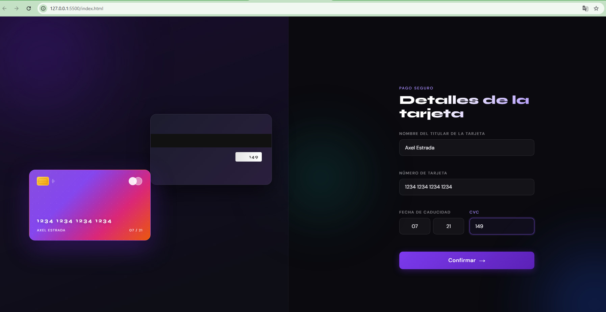

# Formulario Interactivo de Tarjeta de Crédito

Formulario interactivo con previsualización de tarjeta en tiempo real. Desarrollado como solución a un challenge de [Frontend Mentor](https://www.frontendmentor.io), rediseñado con una estética dark luxury.

## Vista previa



> Completá los campos y mirá cómo la tarjeta se actualiza en tiempo real ✦

---

## Funcionalidades

- **Previsualización en vivo** — cada campo actualiza la tarjeta mientras escribís
- **Validación de formulario** — todos los campos se validan al enviar con mensajes de error descriptivos
- **Formato de número de tarjeta** — agrupa automáticamente los dígitos en bloques de 4
- **Estado de éxito** — pantalla de confirmación tras un envío válido, con opción de reiniciar
- **Totalmente responsive** — diseño mobile-first que se adapta a desktop en dos columnas
- **Tarjetas en CSS puro** — sin dependencias de imágenes externas para la UI de la tarjeta

---

## Tecnologías utilizadas

- HTML5 semántico
- CSS3 — custom properties, CSS Grid, Flexbox, animaciones
- JavaScript vanilla (sin frameworks)

---

## Lo que aprendí

- Manejo de actualizaciones del DOM en tiempo real con el evento `input`
- Formateo de inputs (agrupación del número de tarjeta) sin librerías externas
- Técnica de apilamiento con CSS Grid para superponer elementos de forma confiable
- Patrones de validación de formularios sin dependencias de terceros
- Diseño responsive con enfoque mobile-first

---

## Cómo correrlo

No requiere herramientas de build ni dependencias.

```bash
git clone https://github.com/tu-usuario/interactive-card-form.git
cd interactive-card-form
# Abrí index.html en tu navegador — eso es todo
```

O simplemente abrí `index.html` directamente en cualquier navegador moderno.

---

## Estructura del proyecto

```
├── index.html
├── main.css
├── main.js
├── images/
│   └── icon-complete.svg
└── README.md
```

---

## Créditos

Challenge original de [Frontend Mentor](https://www.frontendmentor.io/challenges/interactive-card-details-form-XpS8cKZDWw).
